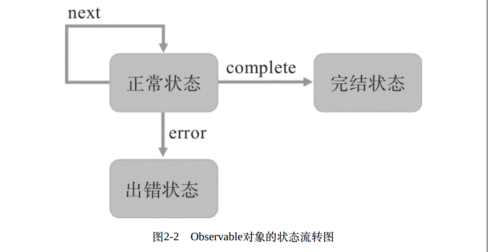

### Observable和Observer

#### 解释

Observable就是“可以被观察的对象”即“可被观察者”

Observer就是“观察者”

> 连接两者的桥梁就是Observable对象的函数subscribe

### 创造Observable

```typescript
import {Observable} from 'rxjs/Observable';

//定义了onSubscribe函数， 这个函数作为参数传递给Observable构造函数
const onSubscribe = observer => {
    //调⽤参数observer的next函数， 把数据“推”给observer
	observer.next(1);
	observer.next(2);
	observer.next(3);
};
//调⽤Observable构造函数， 产⽣⼀个名为source$的数据流对象
const source$ = new Observable(onSubscribe);
//创造观察者theObserver
const theObserver = {
	next: item => console.log(item)
}
//通过subscribe函数将theObserver和source$关联起来
source$.subscribe(theObserver);
/*
输出
1
2
3
*/
```

### 跨越时间的Observable

```typescript
//更改onSubscribe函数，变为每次输出间隔一秒，输出三次
const onSubscribe = observer => {
	let number = 1;
	const handle = setInterval(() => {
	observer.next(number++);
	if (number > 3) {
		clearInterval(handle);
	}
	}, 1000);
};
/*
输出：
1
2
3
*/
```

### 永⽆⽌境的Observable

利用Observable产生无限多的数据

```typescript
//更改onSubscribe函数，将下列代码注释，变为每次输出间隔一秒,不会截止
const onSubscribe = observer => {
	let number = 1;
	const handle = setInterval(() => {
	observer.next(number++);
	//if (number > 3) {
		//clearInterval(handle);
	//}
	}, 1000);
};
/*
输出：
1
2
3
4
...
*/
```

### Observable的完结

在RxJS中，有一种通信机制表示完结状态，实现这种通信机制⽤的就是Observer的complete函数

```typescript

//修改onSubscribe函数
const onSubscribe = observer => {
	let number = 1;
	const handle = setInterval(() => {
		observer.next(number++);
		if (number > 3) {
		clearInterval(handle);
			observer.complete();
		}
	}, 1000);
};

//修改theObserver观察者
const theObserver = {
	next: item => console.log(item),
	complete: () => console.log('No More Data') //添加完结状态
}
/*
输出
1
2
3
/
```

### Observable的出错处理

```typescript
//修改onSubscribe函数
const onSubscribe = observer => {
	observer.next(1);
	observer.error('Someting Wrong');
	observer.complete();
};
//修改观察者
// next: 向Observable‘推’数据
// error: 出错状态
// complete: 完结状态
// 一个Observable对象只有一个状态，要么出错(error)，要么完结(complete)
// 进入出错状态，不会调用Observer的next函数，也不会调用Observer的complete函数
// 进入完结状态，不会调用Observer的next函数，也不会调用Observer的error函数
const theObserver = {
	next: item => console.log(item),
	error: err => console.log(err),
	complete: () => console.log('No More Data'),
}
/*
输出
1
Someting Wrong
*
```

### Observable对象的状态流装换图



### Observer的简单形式

为了让代码更加简洁， 没有必要创造⼀个Observer对象， subscribe也可以直接接受函数作为参数， 第⼀个参数如果是函数类型， 就被认为是next， 第⼆个函数参数被认为是error， 第三个函数参数被认为是complete

```typescript
//第一个参数是函数类型，就被认为是next，第二个参数被认为是error，第三个参数被认为是complete
// source$.subscribe(theObserver);修改为下面代码
source$.subscribe(
    item => console.log(item),
    err => console.log(err),
    () => console.log('no More Data'),
);

//如果不需要对异常进行处理，还是要传递第二个参数来占位置，用null作为第二个参数
source$.subscribe(
    item => console.log(item),
    null,
    () => console.log('no More Data'),
);
//相对应的onSubscribe函数也要更改
const onSubscribe = observer => {
    let number = 1;
    const handle = setInterval(() => {
    observer.next(number++);
    if (number > 3) {
        clearInterval(handle);
        //将错误处理去掉
        // observer.error('Something wrong');
        observer.complete();
    }
  }, 1000);
};
```

### 退订Observable

可以订阅Observable也可以退订Observable

可以只订阅Observable3秒钟，3秒钟之后就可以退订Observable

```typescript
//修改onSubscribe函数，让onSubscribe函数有返回值
const onSubscribe = observer => {
  let number = 1;
  const handle = setInterval(() => {
    console.log('in onSubscribe ' + number );
    observer.next(number++);
    if (number > 3) {
      observer.complete();
    }
  }, 1000);

  return {
    unsubscribe: () => {
      clearInterval(handle);
      console.log('退订');
    }
  }
};

const source$ = new Observable(onSubscribe);
const subscription = source$.subscribe(
  item => console.log(item),
  err => console.log(err),
  () => console.log('no More Data'),
);
//这里延迟3.5秒调⽤subscription上的unsubscribe函数，也就是3.5秒之后退订了
setTimeout(() => {
  subscription.unsubscribe();
}, 3500);
```

可以将14行的`clearInterval(handle);`注释掉,可以发现输出结果为

```typescript
/*
输出结果
in onSubscribe 1
1
in onSubscribe 2
2
in onSubscribe 3
3
no More Data
退订
in onSubscribe 4
in onSubscribe 5
in onSubscribe 6
...
*/
```

从上面可以知道，如果发生退订，那么不管`onSubscribe`函数是否调用了`next`函数，`Observer`都不会做出任何响应

