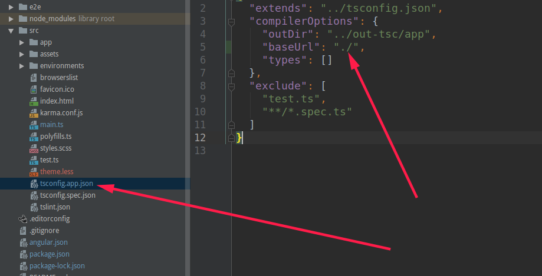

### 创建一个带路由的特性模块

使用这个命令，会生成一个带路由的特性模块， 其中customers是模块的名字

```html
ng generate module customers --routing
```

customers是相对于app目录下的，所以新建好的模块是在app目录下，也可在新建模块的时候在上路径

```html
# 会在mian目录下新建一个customers模块，如果main文件夹不存在，会自动创建一个main文件夹
ng generate module main/customers --routing
```

### 向特性模块中添加组件

```html
ng generate component customers/customer-list
```

这样在customers模块中添加了一个customer-list组件，可以查看component.module.ts添加个CustomerListComponent组件

```typescript
@NgModule({
  imports: [
    CommonModule,
    CustomersRoutingModule
  ],
  declarations: [
      //CustomerListComponent是新添加的
      CustomerListComponent
  ]
})
```

### 更改appp/tsconfig.app.josn文件，添加`"baseUrl": "./"`



### 在app/app-routing.module.ts中加载特性模块

修改之后

```typescript
const routes: Routes = [
  {
    path: 'customers',      
    loadChildren: './customers/customers.module#CustomersModule'
    // ./customers/customers.module表示文件的路径
    //  CustomersModule 表示模块类名称
  },
  {
    path: '',
    redirectTo: '',
    pathMatch: 'full'
  }
];
```

### 在customers模块的customers-routing.module.ts配置路由

```typescript
//加载CustomerListComponent组件，这里的路径是相对于localhost:4200/customers下的路径，而不是localhost:4200下的路径
const routes: Routes = [
  {
    path: '',
    component: CustomerListComponent
  }
];
```

### 访问路径

[访问路径:localhost:4200/customers](localhost4200/customers)

如果customers-routing.module.ts是这样子写的

```typescript
const routes: Routes = [
  {
    path: 'customlist',
    component: CustomerListComponent
  },
  {
    path: '',
    redirectTo: '',
    pathMatch: 'full'
  }
];
```

那么访问路径为: [localhost4200/customers/customlist](localhost4200/customers/customlist)

