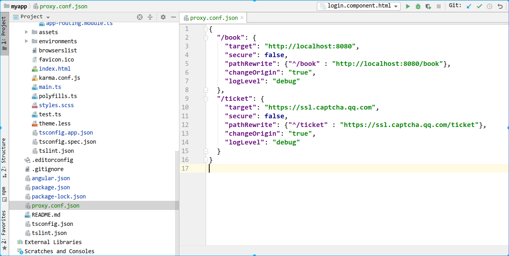
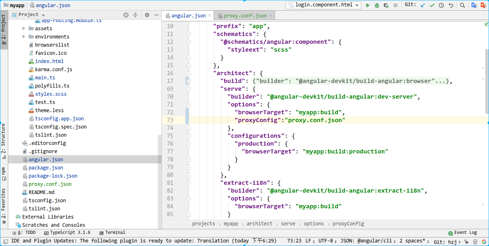

### 代理到后端服务器

> 文章来源: [angular官方文档](https://angular.cn/guide/build#proxying-to-a-backend-server)

1. 在项目的根目录下建立**proxy.conf.json**文件



2. 代理配置文件中添加如下内容

```json
{
  "/book": {
    "target": "http://localhost:8080",
    "secure": false,
    "pathRewrite": {"^/book" : "http://localhost:8080/book"},
    "changeOrigin": "true",
    "logLevel": "debug"
  },
  "/ticket": {
    "target": "https://ssl.captcha.qq.com",
    "secure": false,
    "pathRewrite": {"^/ticket" : "https://ssl.captcha.qq.com/ticket"},
    "changeOrigin": "true",
    "logLevel": "debug"
  }
}
//target: 服务器的域名
//pathRewrite:运行项目时重写url路径,会移除/api部分,替换为后面的内容
//changeOrigin: changeOrigin这个必须设置为true,不设置会不能跨域,我也不知道为什么
//logLevel: 设置在控制台答应debug信息, 信息的日志级别为:代理的有效日志级别是 info（默认值）、debug、warn、error 和 silent
```

3. 在cli的配置文件angular.json中为**projects->"项目名"->architect->serve->options**中添加**proxyConfig**



4. 再重启服务器,使用**ng serve**命令

