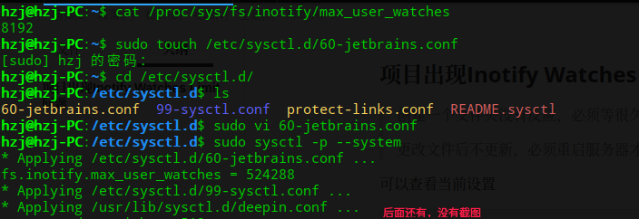
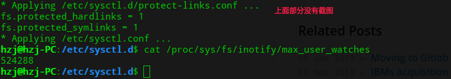

### 项目出现Inotify Watches Limit问题

> 创建一个文件夹没有反应，必须等很久或者关闭项目在打开项目才出现
>
> 更改文件后不更新，必须重启服务器才能够更新

可以查看当前设置

```html
cat /proc/sys/fs/inotify/max_user_watches
# 8192
```

在`/etc/sysctl.d`文件夹下新建`60-jetbrains.conf`文件

```html
sudo touch /etc/sysctl.d/60-jetbrains.conf
```

在`60-jetbrains.conf文件中添加下列内容`

```html
# Set inotify watch limit high enough for IntelliJ IDEA (PhpStorm, PyCharm, RubyMine, WebStorm).
# Create this file as /etc/sysctl.d/60-jetbrains.conf (Debian, Ubuntu), and
# run `sudo service procps start` or reboot.
# Source: https://confluence.jetbrains.com/display/IDEADEV/Inotify+Watches+Limit
# 
# More information resources:
# -$ man inotify # manpage
# -$ man sysctl.conf # manpage
# -$ cat /proc/sys/fs/inotify/max_user_watches # print current value in use

fs.inotify.max_user_watches = 524288
```

重新启动systemd

```html
sudo sysctl -p --system
```

重启IDE

参考文档[https://robbinespu.github.io/eng/2018/08/25/slow_file_changes_sync_inotify_limits.html](https://robbinespu.github.io/eng/2018/08/25/slow_file_changes_sync_inotify_limits.html)

具体截图



